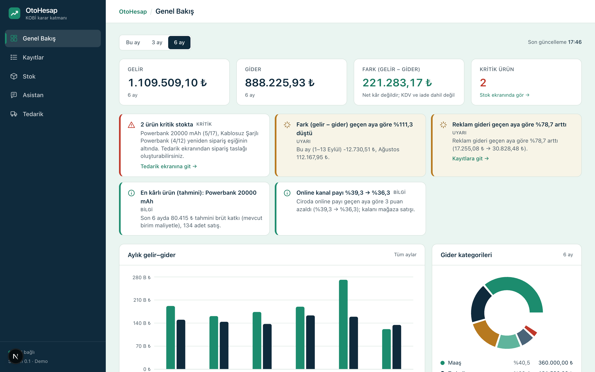
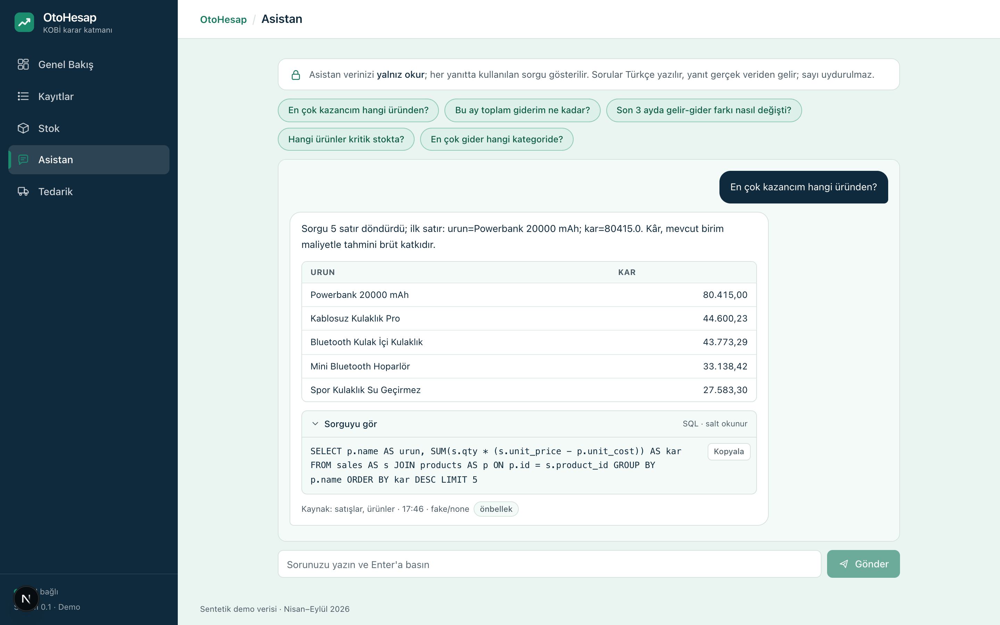
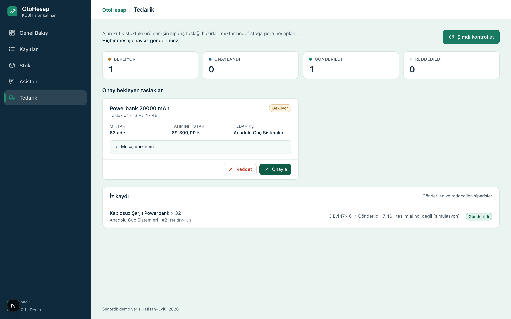

<div align="center">


# OtoHesap

**Next-Generation Financial Analytics, Safe Text-to-SQL & Autonomous Supply Management for SMBs**  
*KOBİ'ler için Yeni Nesil Finansal Analitik, Güvenli Text-to-SQL ve Otonom Tedarik Yönetim Platformu*

[](https://github.com/Farukes/Oto-Hesap/actions/workflows/ci.yml)
[](https://fastapi.tiangolo.com)
[](https://nextjs.org)
[](https://www.postgresql.org)
[](https://tailwindcss.com)
[](https://www.typescriptlang.org)
[](https://www.python.org)
[](LICENSE)

<br/>

[**English**](#english) &nbsp;•&nbsp; [**Türkçe**](#türkçe)

</div>

---

<a name="english"></a>
## 🇬🇧 English

### 📌 Overview

**OtoHesap** is an end-to-end financial operations and inventory intelligence platform tailored for small and medium-sized businesses (SMBs). Positioned between rigid ERP suites and fragile spreadsheets, OtoHesap allows business owners to converse with their database using natural language, monitor real-time financial KPIs, and automate reordering with human-verified autonomous supplier notifications.

---

### ✨ Key Features

* **Natural Language to SQL (Text-to-SQL):** Query your business data in plain language (e.g., *"Which product generated the highest revenue this month?"*). The system translates questions into validated SQL, executes queries against a strictly read-only database role, and surfaces both the answer and the exact generated SQL transparently.
* **Real-Time Visual Analytics:** Instant overview of key financial metrics (Revenue, Expenses, Difference, Critical Stock), monthly trends, category expense breakdowns, custom date filtering, and one-click CSV export.
* **Autonomous Supply Agent (Human-in-the-Loop):** Monitors inventory levels continuously. When stock drops below reorder points, it automatically drafts purchase orders and dispatches formatted supplier purchase requests via Telegram Bot API **only after explicit human confirmation**.
* **Rule-Based Insights:** Detects operational anomalies, margin changes, and expense spikes automatically to surface actionable business warnings.

---

### 🖼️ Screenshots

#### Executive Dashboard & Cashflow Overview


<br/>

| Natural Language Financial Assistant | Autonomous Reordering & Approval Panel |
|:---:|:---:|
|  |  |

---

### 🏛️ System Architecture

```
[ Web Browser / Client ]
           │
           ▼  (HTTPS / REST)
[ Next.js 16 Web Application ] (apps/web)
           │
           ▼  NEXT_PUBLIC_API_URL
[ FastAPI Backend Service ] (apps/api)
           ├── Routers:   summary · sales · expenses · products · analytics · assistant · orders · agent
           ├── Services:  text2sql (AST Parser + Whitelist Guard + Read-Only Execution)
           │              agent (Threshold Monitoring + Draft Generation)
           │              notify (Telegram Bot API Integration)
           │              llm (Anthropic / Gemini / Groq / Mock Multi-Provider Adapter)
           │              insights (Rule-Based Anomaly & Risk Engine)
           └── Scheduler: APScheduler Periodic Background Runner
           │
           ▼
[ PostgreSQL 16 ] (Primary App Role + Restricted otohesap_ro Read-Only Role)
```

---

### 🛡️ Security & Safe Autonomy

1. **Defense-in-Depth Text-to-SQL:**
   - **Dedicated Read-Only Role (`otohesap_ro`):** The natural language engine connects via a restricted database user granted only `SELECT` privileges on business tables. Structural modifications and write operations (`INSERT`, `UPDATE`, `DELETE`, `DROP`, `ALTER`) are fundamentally disallowed by PostgreSQL permissions.
   - **AST Validation (`sqlglot`):** Every generated query is parsed into an Abstract Syntax Tree (AST). Queries containing non-whitelisted tables, system tables (`pg_*`, `information_schema`), recursive CTEs, multiple statements (`;`), comments, or disallowed functions are blocked prior to execution.
   - **Guardrails:** Automatic `LIMIT 200` enforcement, 5-second `statement_timeout`, and strict column masking for sensitive credentials.
2. **Controlled Autonomy (Human-in-the-Loop):**
   - The procurement agent only creates `draft` orders.
   - External supplier messages (via Telegram Bot API) are never dispatched without explicit user verification in the UI.

---

### 🚀 Quick Start

#### Prerequisites
- **Python 3.12+** & [uv](https://docs.astral.sh/uv/)
- **Node.js 20+** or [Bun](https://bun.sh/)
- **PostgreSQL 16**

#### 1. Clone the Repository
```bash
git clone https://github.com/Farukes/Oto-Hesap.git
cd Oto-Hesap
```

#### 2. Environment Configuration
Copy `.env.example` to `.env` and fill in your connection parameters:
```bash
cp .env.example .env
```
Key configuration values:
* `DATABASE_URL`: Primary database connection string
* `DATABASE_URL_RO`: Dedicated read-only role connection string
* `LLM_PROVIDER`: `anthropic` | `gemini` | `groq` | `fake` (for offline demo/testing)
* `TELEGRAM_BOT_TOKEN` & `TELEGRAM_DEFAULT_CHAT_ID`: Optional supplier notification keys

#### 3. Database Migration & Synthetic Seed Data
```bash
# Apply schema and role grants
psql "$DATABASE_URL" -f docs/schema.sql

# Seed 6 months of realistic, deterministic SMB business data (seed=42)
make seed
```

#### 4. Run Services

**Terminal 1 (Backend API):**
```bash
make api
# Interactive Swagger docs available at http://localhost:8000/docs
```

**Terminal 2 (Frontend Web):**
```bash
make web
# Dashboard accessible at http://localhost:3000
```

---

<br/>

---

<a name="türkçe"></a>
## 🇹🇷 Türkçe

### 📌 Proje Hakkında

**OtoHesap**, küçük ve orta ölçekli işletmelerin (KOBİ) finansal gelir-gider takibini, stok envanterini ve tedarik süreçlerini tek ekranda birleştiren yeni nesil bir karar ve operasyon yönetim platformudur.

Geleneksel karmaşık ERP yazılımları ile yetersiz kalan elektronik tablolar arasında sıkışan işletmeler için doğal dil ile veriye erişim, gerçek zamanlı analitik panolar ve insan onaylı otonom tedarik akışları sunar.

---

### ✨ Temel Yetenekler

* **Doğal Dilden SQL'e (Text-to-SQL):** Verilerinize Türkçe doğal dilde sorular sorun (*"Bu ay en yüksek kâr katkısı sağlayan ürünüm hangisi?"*). Sistem soruyu anında AST doğrulamalı SQL sorgusuna dönüştürür, salt-okur veritabanı kullanıcısıyla çalıştırır ve hem analitik yanıtı hem de üretilen SQL sorgusunu şeffafça ekranda gösterir.
* **Gerçek Zamanlı Görsel Analitik:** Finansal KPI kartları (Gelir, Gider, Fark, Kritik Stok), aylık gelir-gider trendi, kategori bazlı harcama dağılımı, dönem filtreleri ve tek tıkla CSV dışa aktarımı.
* **Otonom Tedarik Ajanı (Human-in-the-Loop):** Kritik stok eşiğine düşen ürünleri sürekli izler, otomatik sipariş taslağı üretir ve **yalnızca kullanıcı arayüz üzerinden onay verdiğinde** tedarikçiye Telegram Bot API üzerinden siparişi iletir.
* **Kural Tabanlı Finansal İçgörüler:** Harcamalardaki dönemsel sapmaları, anormallikleri ve stok risklerini önceden tespit ederek işletme sahibine aksiyon kartları sunar.

---

### 🛡️ Güvenlik ve Kontrollü Otonomi

1. **Katmanlı Text-to-SQL Güvenliği (Defense-in-Depth):**
   - **Salt-Okur Rol (`otohesap_ro`):** Asistan sorguları veritabanında yalnızca `SELECT` yetkisine sahip kısıtlı kullanıcı rolüyle yürütülür; veri değiştirme veya silme teknik olarak engellenmiştir.
   - **AST Doğrulaması (`sqlglot`):** Üretilen SQL ifadeleri soyut sözdizim ağacına ayrıştırılır. Tablo beyaz listesinde yer almayan yapılar, sistem tabloları (`pg_*`), birden fazla sorgu (`;`) ve riskli fonksiyonlar derhal reddedilir.
   - **Sorgu Kısıtları:** Sorgulara otomatik `LIMIT 200` eklenir ve 5 saniyelik zaman aşımı (`statement_timeout`) uygulanır.
2. **Kontrollü Otonomi:**
   - Tedarik ajanı stok eşiği aşıldığında yalnızca `draft` (taslak) statüsünde sipariş üretir.
   - Kullanıcı açıkça "Onayla" butonuna basmadıkça dış dünyaya hiçbir bildirim iletilmez.

---

### 🚀 Hızlı Başlangıç

#### 1. Depoyu Klonlayın
```bash
git clone https://github.com/Farukes/Oto-Hesap.git
cd Oto-Hesap
```

#### 2. Ortam Değişkenlerini Tanımlayın
```bash
cp .env.example .env
```
`.env` dosyasında `DATABASE_URL`, `DATABASE_URL_RO` ve `LLM_PROVIDER` alanlarını yapılandırın.

#### 3. Veritabanını Kurun ve Sentetik Veriyi Yükleyin
```bash
psql "$DATABASE_URL" -f docs/schema.sql
make seed
```

#### 4. Uygulamayı Başlatın
```bash
make api   # FastAPI servisi: http://localhost:8000/docs
make web   # Next.js arayüzü: http://localhost:3000
```

---

### 📋 Kullanışlı Komutlar (`Makefile`)

| Komut | Açıklama |
|---|---|
| `make api` | FastAPI arka uç servisini geliştirme modunda başlatır |
| `make web` | Next.js ön yüz uygulamasını başlatır |
| `make seed` | Veritabanını sıfırlar ve sentetik test verilerini yükler |
| `make test` | API test paketini çalıştırır |
| `make lint` | Python (`ruff`) ve TypeScript (`eslint`) kod denetimlerini yürütür |
| `make warmup` | Canlı sunum öncesi API ve veritabanı havuzunu ısıtır |

---

## 👥 Ekip / Contributors

* **Kutay Yıldırım** — Frontend & UI/UX Architecture
* **Muratcan Ateş** — Backend Core, Database & Security
* **Ömer Faruk Eskitürk** — Autonomous Supply Agent, Order Management & Telegram Integration
